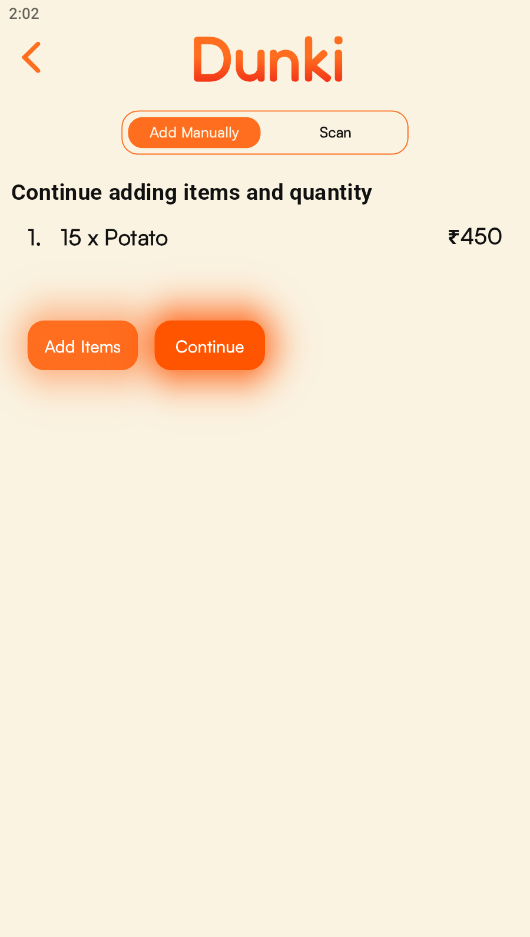
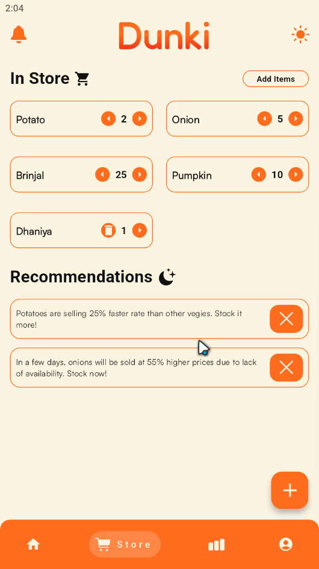
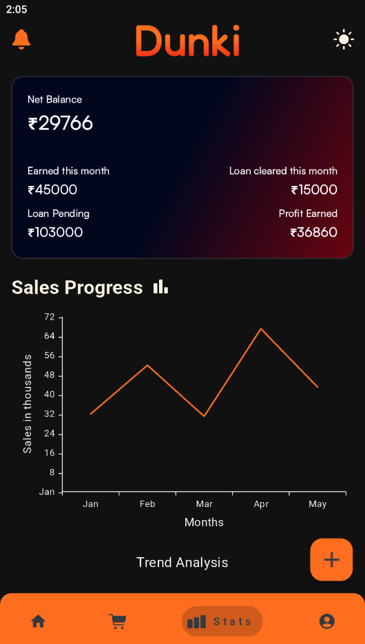

<h1>Dunki</h1>
<strong><i>A Modern Grocery Store management app</i></strong>
 
 

> This app is merely a notion. At the moment, all of the data is generated at random and it does not support fundamental functions.

 

<h3>Screenshots</h3>
 

<h3>Dark Mode Support</h3>

## Tech Stacks

